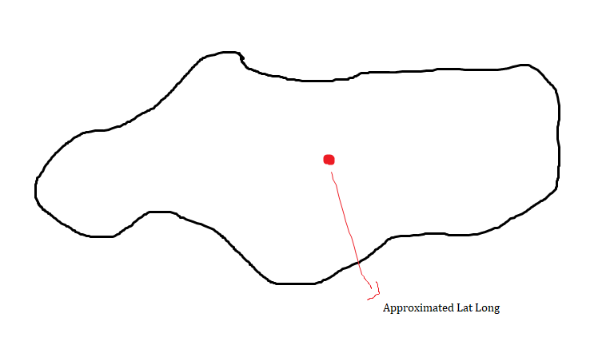
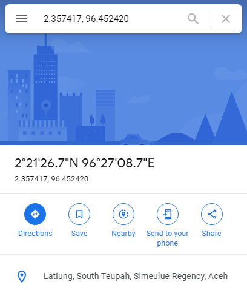
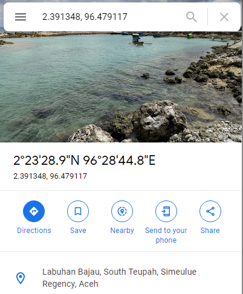

# indonesia-locations-data
CSV data of latitude and longitude data of some locations in Indonesia

Data sources:
- [Geojson format of villages' border in indonesia](https://github.com/pararawendy/border-desa-indonesia-geojson)
- [Provinces and cities lat long](https://github.com/benangmerah/wilayah)
- [Locations names](https://github.com/edwardsamuel/Wilayah-Administratif-Indonesia)

I know how hard it is to find the lat long data of villages in Indonesia. I did found the border data of villages in indonesia [1], but what I need was a single point of latitude and longitude.

So the idea was to approximate the latitude and longitude using the mean of borders. See the illustration below:
* The black line is the border from the geojson file [1]
* The red dot is what we want to find

This goes the same with approximating the lat long of districts; calculate the mean of approximated villages' lat long. Here are a couple of results from the villages data and the google maps result of approximated coordinates:

## CSV Result

## Google Maps

> Disclaimer: The coordinates are approximated and I haven't got the time to check ALL the points. So, I can't guarantee the coordinates are 100% correct. But I hope it will be helpful if one needs some quick data

Feel free to use it. I would also really apprecite it if you give some credits when using it. Cheers!
